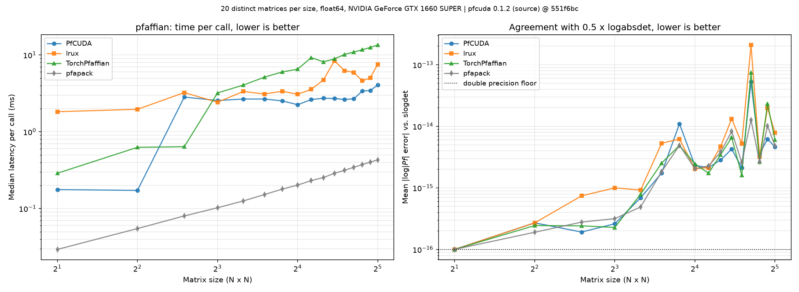
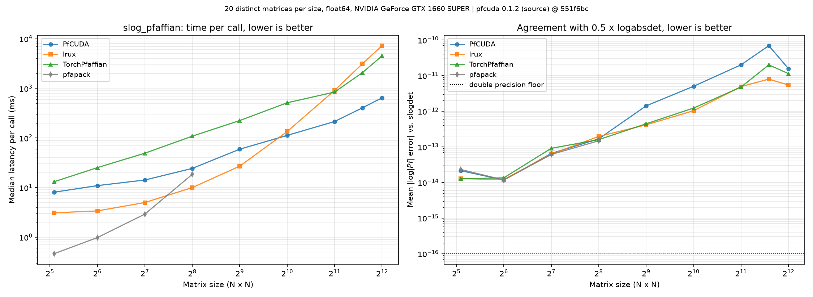

# PfCUDA

[](https://www.python.org/downloads/)
[](https://developer.nvidia.com/cuda-toolkit)
[](LICENSE)

**GPU-accelerated Pfaffian computation for JAX.**

For a `2n x 2n` skew-symmetric matrix `A`, the Pfaffian satisfies `Pf(A)^2 = det(A)`.
PfCUDA computes it with CUDA kernels exposed through JAX's foreign function
interface, with differentiable (JVP) support, plus C++ and NumPy CPU backends.

---

## ⚙️ Requirements

PfCUDA compiles CUDA kernels from source at install time, so you need a CUDA
Toolkit — not just a driver.

| Requirement | Notes |
| --- | --- |
| NVIDIA GPU | compute capability 7.5+ with a CUDA 13 toolkit, which dropped support for older cards; earlier toolkits reach further back |
| CUDA Toolkit | provides `nvcc`; found via `PATH`, `CUDA_HOME` or `/usr/local/cuda` |
| CMake ≥ 3.18, C++17 compiler | |
| Python ≥ 3.10 | with development headers (`python3-dev`) |
| `jax` ≥ 0.5.0 | `jax.ffi` became public in 0.5.0; tested against 0.11.1 |

**Platform support** follows JAX's own CUDA support:

| Platform | Status |
| --- | --- |
| Linux x86_64 / aarch64 | Supported |
| Windows via WSL2 | Works; JAX calls WSL2 CUDA support experimental |
| Native Windows | **Not supported** — JAX has no CUDA wheels for it |
| macOS | **Not supported** — no NVIDIA CUDA |

On native Windows, install [WSL2](https://learn.microsoft.com/windows/wsl/install)
and use PfCUDA inside it. The CPU backends (`pfaffian_cpu`, `pfaffian_py`) work
anywhere the package can be built.

---

## 📦 Installation

Pick the extra matching your driver's CUDA version (`nvidia-smi` reports it):

```bash
pip install "pfcuda[cuda13]"    # or "pfcuda[cuda12]"
```

This builds from source and takes a couple of minutes. The extra matters: plain
`pip install pfcuda` pulls a **CPU-only** jax, which compiles fine but then
fails at call time with `No FFI handler registered`.

If `nvcc` lives somewhere unusual, point the build at it:

```bash
CUDA_HOME=/path/to/cuda pip install "pfcuda[cuda13]"
```

Kernels are compiled for every major architecture your CUDA toolkit supports,
so **building where no GPU is visible works** — inside a container, in CI, or on
an HPC login node before running on a GPU node. To build only for the card in
the build machine, which is smaller and about twice as fast to compile:

```bash
CMAKE_ARGS="-DCMAKE_CUDA_ARCHITECTURES=native" pip install "pfcuda[cuda13]"
```

To install from a clone instead:

```bash
git clone https://github.com/Mou1z/PfCUDA.git
cd PfCUDA
pip install .
```

> **Upgrading JAX?** The compiled kernels bind to the XLA FFI ABI of the jaxlib
> they were built against, and that ABI is not stable across releases. After
> upgrading `jax`/`jaxlib`, reinstall PfCUDA with
> `pip install --force-reinstall --no-binary pfcuda pfcuda`.

---

## 🚀 Quick Start

```python
import numpy as np
import jax, jax.numpy as jnp
import pfcuda

jax.config.update("jax_enable_x64", True)

A = np.array([
    [ 0.0,  1.0,  2.0,  3.0],
    [-1.0,  0.0,  4.0,  5.0],
    [-2.0, -4.0,  0.0,  6.0],
    [-3.0, -5.0, -6.0,  0.0],
], dtype=np.float64)

pfcuda.pfaffian(jnp.array(A))      # GPU, matrices up to 32x32  -> 8.0
pfcuda.pfaffian_cpu(A.copy())      # C++ backend, any even size -> 8.0
pfcuda.pfaffian_py(A.copy())       # NumPy reference            -> 8.0

# slog_pfaffian is for large matrices and requires n >= 34.
rng = np.random.default_rng(0)
B = rng.normal(size=(64, 64))
B = B - B.T
log_abs, sign = pfcuda.slog_pfaffian(jnp.array(B))
```

`pfcuda.CUDA_AVAILABLE` reports whether the GPU backend loaded; the CPU
functions remain usable when it did not.

---

## 📚 API Reference

All inputs must be **square, skew-symmetric and of even dimension**. Odd
dimensions return zero from `pfaffian`, `(-inf, 0)` from `slog_pfaffian` and
`0.0` from `pfaffian_py`; `pfaffian_cpu` raises `RuntimeError` instead.

| Function | Backend | Dtypes | Size | Returns |
| --- | --- | --- | --- | --- |
| `pfaffian(A)` | GPU (CUDA/JAX) | `float32`, `float64`, `complex64`, `complex128` | `n ≤ 32` | `Pf(A)` |
| `slog_pfaffian(A)` | GPU (CUDA/JAX) | `float32`, `float64`, `complex64`, `complex128` | `n ≥ 34` | `(log|Pf|, sign)` |
| `pfaffian_cpu(A)` | CPU (C++) | `float64` only | any even | `Pf(A)` |
| `pfaffian_py(A)` | CPU (NumPy) | any NumPy float dtype | any even | `Pf(A)` |

Two behaviours worth knowing:

- **`pfaffian_cpu` is float64-only.** Other dtypes are cast on the way in, so
  complex input silently loses its imaginary part. Use `pfaffian` for complex
  matrices.
- **`pfaffian_cpu` and `pfaffian_py` overwrite their input** for `n > 4`. Pass a
  copy if you still need the matrix.

`pfaffian` and `slog_pfaffian` define custom JVP rules, so they work under
`jax.grad`, `jax.jit` and `jax.vmap`.

---

## 📊 Benchmarks vs. Lrux

Comparison against [Lrux](https://pypi.org/project/lrux/), an existing
JAX-based library. Scripts are in `benchmarking/`; raw data in `benchmarks/`.
All times are **milliseconds per call**, measured end to end from Python
(so they include JAX dispatch overhead, not kernel time alone).




**Small matrices — `pfaffian`, n = 2…32.** PfCUDA leads by 9.8× at n=2
(0.168 ms vs 1.639 ms), narrowing to 1.16× at n=32 (3.07 ms vs 3.56 ms).

**Large matrices — `slog_pfaffian`, n = 100…4900.** Lrux is faster at n=100
(10.2 ms vs 3.1 ms); PfCUDA overtakes it between n=100 and n=500 and pulls
ahead from there, reaching 20.4× at n=4900 (997.6 ms vs 20 369.9 ms).

**Accuracy.** Log-accuracy error stays between 10⁻¹¹ and 10⁻¹⁶ across all sizes
for both libraries.

---

## 🛠️ Implementation

- **GPU** — CUDA kernels behind JAX's FFI with custom JVP rules.
  `src/pfaffian.cu`, `src/pfaffian_sm.cu`, `src/slog_pfaffian.cu`,
  `src/slog_pfaffian_lg.cu`, `bindings/jax_bindings.cu`
- **CPU (C++)** — pybind11 module. `src/pfaffian_cpu.cpp`,
  `bindings/pybind_bindings.cpp`
- **CPU (NumPy)** — pure-Python reference. `pfcuda/pfaffian_py.py`

---

## 🧑‍💻 Development

Use the `./dev` driver rather than `pip install .`. It builds the libraries
directly into `pfcuda/`, so an incremental rebuild takes about 5 seconds
instead of two minutes.

```bash
git clone https://github.com/Mou1z/PfCUDA.git
cd PfCUDA
./dev
```

The first run creates `.venv`, picks the CUDA 12 or 13 `jax` plugin to match
your driver, installs dependencies and configures CMake.

| Command | Purpose |
| --- | --- |
| `./dev` | Build, then run the fast tests (~12 s) |
| `./dev build` | Build only |
| `./dev test` | Build, then run the full suite (~75 s) |
| `./dev bench` | Build, then run the benchmarks |
| `./dev doctor` | Report on the environment; changes nothing |
| `./dev clean` | Remove build outputs (`--all` also removes `.venv`) |

On Windows use `.\dev.ps1 <command>` from PowerShell, which forwards into WSL2.
`./dev --help` lists the environment overrides. If something fails to build,
`./dev doctor` reports what it found.

---

## 📝 Citation

> **Muhammad Mouiz Ghouri**, *"Optimized Pfaffian Computation and Its
> Differentiation: From CPU Implementations to GPU Acceleration"*,
> Eötvös Loránd University, Budapest, Hungary, 2026.

## 🤝 Contributing

Issues and pull requests are welcome — particularly for broader dtype coverage
on the CPU backend, additional GPU architectures, and benchmark comparisons.

## 📄 License

[MIT](LICENSE)
